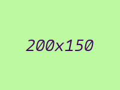
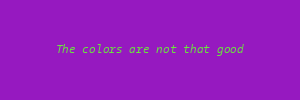

# Dev Tools

Tools for Laravel development

[](https://packagist.org/packages/soyhuce/dev-tools)
[](https://packagist.org/packages/soyhuce/dev-tools)

- [Installation](#installation)
- [Available tools](#available-tools)
    - [Debug](#debug)
    - [Bottleneck Middleware](#bottleneckmiddleware)
    - [Image Faker](#image-faker)

## Installation

You can install the package via composer:

``` bash
$ composer require soyhuce/dev-tools --dev
```

Laravel will discover the service provider `Soyhuce\DevTools\ServiceProvider`.

After installing Dev Tools, publish its assets using:

```bash
php artisan vendor:publish --provider="Soyhuce\DevTools\ServiceProvider" --tag="config"
```

You can also add the facade to your alias in `config\app.php` :
```php
'Debug' => \Soyhuce\DevTools\Debug\Debug::class,
```

## Available tools

 - [Debug](#debug) : Debugging tools
    - [Counter](#counter)
    - [Database](#database)
    - [Memory](#memory)
    - [Message](#message)
    - [Model](#model)
    - [Request](#request)
    - [Response](#response)
    - [Time](#time)
    - [Special case of http testing](#special-use-case-of-http-testing)
 - [BottleneckMiddleware](#bottleneckmiddleware) : Middleware simulating a bottleneck
 - [Image faker](#image-faker) : Generates random images locally

### Debug

When activated, it allows logging some information on request execution: HTTP request, HTTP response, database requests, timings or even used memory.

All collected information timestamped and sent in your default log channel, with debug level.

Every module can be activated or deactivated separately thanks to the config file. You can configure the timestamp format as you wish.

#### Counter

The counter can help to count stuffs. The counter does not need to exist before incrementing it. As it is initialized with 0. 

```php
<?php

for ($i=0; $i<100; $i++) {
    if (rand(0,1) === 0) {
        \Soyhuce\DevTools\Debug\Debug::incrementCounter('zeros');
    } else {
        \Soyhuce\DevTools\Debug\Debug::incrementCounter('ones');
    }
}
```
```
[2020-06-10 11:41:08] testing.DEBUG: 
=> [2020-06-10 11:41:08.819242] counter : zeros -> 56
=> [2020-06-10 11:41:08.819243] counter : ones -> 44
```

Counters can be incremented by more than one.
```php
<?php

function foo(array $values)
{
    \Soyhuce\DevTools\Debug\Debug::incrementCounter('foo', count($values));
}

foo([1,2,3]);
foo([4,5]);
foo([6,7,8,9]);
```
```
[2020-06-10 11:47:18] testing.DEBUG: 
=> [2020-06-10 11:47:18.252515] counter : foo -> 9
```

#### Database

Every executed database query is collected with its bindings and duration. The total number of executed queries is also logged.

```
[2020-06-10 11:56:17] testing.DEBUG: 
=> [2020-06-10 11:56:17.897045] database : select * from "users" -> 290μs
=> [2020-06-10 11:56:17.898037] database : select "id", "name" from "users" where "email" like '%@foo.com' -> 120μs
=> [2020-06-10 11:56:17.901442] database : query executed : 2
```

You can define a threshold and raise a warning if the number of executed queries is above this threshold.
```
[2020-06-10 12:05:47] testing.DEBUG: 
=> [2020-06-10 12:05:47.119866] database : select * from "users" -> 280μs
=> [2020-06-10 12:05:47.120715] database : select "id", "name" from "users" where "email" like '%@foo.com' -> 80μs
=> [2020-06-10 12:05:47.124023] database : query executed : 2
!!!!!!!!!!!!!!!!!!!!!!!!!!!!!!!!!!!!!!!!!!!!!!!!!!!!!!!!!!!!!
!! database : Number of queries exceeded max 1 allowed : 2 !!
!!!!!!!!!!!!!!!!!!!!!!!!!!!!!!!!!!!!!!!!!!!!!!!!!!!!!!!!!!!!! 
```

#### Memory

The Memory collector will collect the memory peak usage and add it to the log.

```
[2020-06-10 12:09:16] local.DEBUG: 
=> [2020-06-10 12:09:16.593738] memory : 16.22Mo
```

You can define a threshold and raise a warning if the memory peak usage id above this threshold.
```
[2020-06-10 12:10:47] testing.DEBUG: 
=> [2020-06-10 12:10:47.391816] memory : 18.27Mo
!!!!!!!!!!!!!!!!!!!!!!!!!!!!!!!!!!!!!!!!!!!!!!!!!!!!!!!!!
!! memory : Memory exceeded max 16Mo allowed : 18.27Mo !!
!!!!!!!!!!!!!!!!!!!!!!!!!!!!!!!!!!!!!!!!!!!!!!!!!!!!!!!!!  
```

#### Message

You can send messages in the debugger flow calling `Debug::message`

```php
<?php
function foo(string $arg) 
{
    \Soyhuce\DevTools\Debug\Debug::message("foo with '${arg}'");
}

foo('bar');
```
```
[2020-06-10 12:20:15] testing.DEBUG: 
=> [2020-06-10 12:20:15.944849] message : foo with 'bar'
```

#### Model

When enabled, the collector allows you to count the number of models retrieved from the database during the queries.

```
[2020-06-10 12:36:12] testing.DEBUG: 
=> [2020-06-10 12:36:12.155134] model : App\User -> 8
=> [2020-06-10 12:36:12.156016] model : App\Post -> 13
```

#### Request

Request data can be collected. We store HTTP verb, url and parameters.

```php
class ExampleTest extends TestCase
{
    public function testBasicTest()
    {
        $this->get('/?foo=bar')->assertOk();
    }
}
```
```
[2020-06-10 12:25:28] testing.DEBUG: 
=> [2020-06-10 12:25:28.130223] request : GET http://localhost
{
    "foo": "bar"
}
```

#### Response

Response can also be collecter with its status code and body.

```php
class ExampleTest extends TestCase
{
    public function testBasicTest()
    {
        $this->getJson('api/users/1')->assertOk();
    }
}
```
```
[2020-06-10 12:27:21] testing.DEBUG: 
=> [2020-06-10 12:27:21.440427] response : 200 -> 
{"id":1,"name":"Melyssa Kautzer","email":"junius.steuber@example.net","email_verified_at":"2020-06-09T13:06:39.000000Z","created_at":"2020-06-09T13:06:39.000000Z","updated_at":"2020-06-09T13:06:39.000000Z"}
```

#### Time

Time collector will automatically measure booting time (laravel) and application time (your application).
 
It is possible to time performance portions via the facade :
```php
<?php
\Soyhuce\DevTools\Debug\Debug::startMeasure('someOperation');
$value = someOperation();
\Soyhuce\DevTools\Debug\Debug::stopMeasure('someOperation');
```
```
[2020-06-10 12:48:02] testing.DEBUG: 
=> [2020-06-10 12:48:02.295700] time : Booting -> 98.57ms
=> [2020-06-10 12:48:02.513956] time : someOperation -> 816.11μs
=> [2020-06-10 12:48:02.517676] time : Application -> 222.05ms
```

`startMeasure` and `stopMeasure` calls do not have to be in the part of code, but a measure cannot be stopped if not started (nor started if already running).
  
Above example can be simplified using `Debug::measuring` method :
```php
<?php
$value = \Soyhuce\DevTools\Debug\Debug::measuring('someOperation', function () {
    return someOperation();
});
// Or even shorter :
$value = Debug::measuring('someOperation', fn () => someOperation());
```
  
All running measurements are stopped before logging.

You can also measure multiple times with the same key. All measures are stored together, and the log will provide you some statistics.

```php
<?php
foreach($users as $user) {
    \Soyhuce\DevTools\Debug\Debug::measuring('updateUser', fn () => $this->update($user));
}
```
```
[2020-06-10 12:58:18] testing.DEBUG: 
=> [2020-06-10 12:58:17.157334] time : Booting -> 86.97ms
=> [2020-06-10 12:58:18.251381] time : updateUser -> 904.28ms cumulated on 12 entries (avg : 75.36ms - min : 67.8ms - max : 90ms - std : 5.4ms)
=> [2020-06-10 12:58:18.259324] time : Application -> 1.1s
```

Finally, you can define a threshold and raise a warning if the application duration is above this threshold.
```
[2020-06-10 12:58:18] testing.DEBUG: 
=> [2020-06-10 12:58:17.157334] time : Booting -> 86.97ms
=> [2020-06-10 12:58:18.251381] time : updateUser -> 904.28ms cumulated on 12 entries (avg : 75.36ms - min : 67.8ms - max : 90ms - std : 5.4ms)
=> [2020-06-10 12:58:18.259324] time : Application -> 1.1s
!!!!!!!!!!!!!!!!!!!!!!!!!!!!!!!!!!!!!!!!!!!!!!!!!!!!!!!!!!!!!!!!!!!
!! time : Application duration exceeded max 500ms allowed : 1.1s !!
!!!!!!!!!!!!!!!!!!!!!!!!!!!!!!!!!!!!!!!!!!!!!!!!!!!!!!!!!!!!!!!!!!! 
```

#### Special use case of HTTP testing

When doing http testing, it is common to bootstrap database or execute some operation we do not want to add to our debug log.

For example:
```php
/** @test */
public function userIsFetched()
{
    $user = factory(\App\User::class)->create();
    
    $this->putJson("api/users/{$user->id}",[
            'name' => 'John Doe'
        ])
        ->assertOk();
    
    $this->assertDatabaseHas('users',[
        'id' => $user->id,
        'name' => 'John Doe'
    ]);    
}
```

We are actually not interested in (for example) database queries of `factory(\App\User::class)->create()` nor `assertDatabaseHas`.

This package will take care of drop any collected information during bootstrap and return only interesting ones i.e. what occurred in `$this->putJson("api/users/{$user->id}",['name' => 'John Doe'])`.
You just have to ensure that you are using `testing` environment during your tests (which should already be your case as it is Laravel default).
```
[2020-06-10 13:47:11] testing.DEBUG: 
=> [2020-06-10 13:47:11.522116] time : Booting -> 522.11ms
=> [2020-06-10 13:47:11.522194] request : GET http://localhost/user/25
=> [2020-06-10 13:47:11.528122] database : select * from "users" where "id" = '25' limit 1 -> 160μs
=> [2020-06-10 13:47:11.528266] model : App\User -> 1
=> [2020-06-10 13:47:11.532207] response : 200 -> 
{"id":25,"name":"Daisha Schuppe","email":"sauer.jarrell@example.com","email_verified_at":"2020-06-10T13:47:11.000000Z","created_at":"2020-06-10T13:47:11.000000Z","updated_at":"2020-06-10T13:47:11.000000Z"}
=> [2020-06-10 13:47:11.532334] memory : 20Mo
=> [2020-06-10 13:47:11.532339] database : query executed : 1
=> [2020-06-10 13:47:11.532344] time : Application -> 10.23ms
``` 


### BottleneckMiddleware

This middleware adds some latency to your requests, server side. It can be useful to check how your application behaves when the user does not have a good network connection.

`Soyhuce\DevTools\Middlewares\BottleneckMiddleware` can be used as a classic middleware.
To use it, just add the middleware in your `App/Http/Kernel.php` or in your route file(s).

You can modify bottleneck duration in `config/dev-tools.php` file.

You also may want to apply it for only ajax requests. If so, adjust the `only_ajax` value. Please ensure that the ajax requests are sent with the `X-Requested-With` header set to `XMLHttpRequest`.

### Image Faker

Sometimes you want to generate images locally for testing, placeholders, ...

You can then use `Soyhuce\DevTools\Faker\Image` to do so. For this, you have to install `intervention/image`.

```
Image::generate(int $width = 640, int $height = 640, ?string $text = null, string $encoding = 'jpg'): \Intervention\Image\Image
```

It will generate an image with random color and with the given text (or "width x height"). For example :

`Image::generate(200, 150)`



`Image::generate(300, 100, 'The colors are not that good', 'png')`



See [intervention/image documentation](http://image.intervention.io/) to know how to use returned image.
